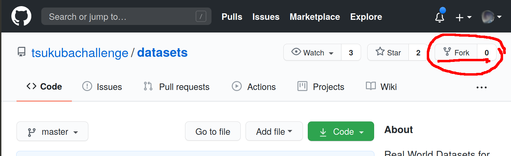
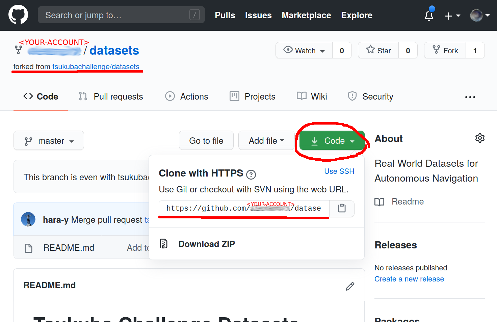
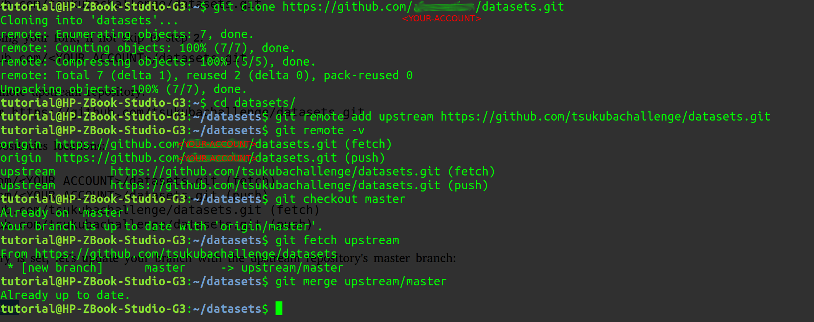

# Tsukuba Challenge Datasets

## Real World Datasets for Autonomous Navigation

## Introduction

Autonomous robot navigation in real-world unaltered outdoor environments is a highly complex problem, not only for the technological challenges involved in safe robot navigation, but also for the preparations and management involved.

Having experienced several times the arduous procedure of having a robot operating in outdoors, we know it is hardly a single person job, a team has to deal with several tasks including: a priori preparations of equipment (at least charging several sets of batteries), transportation or logistics to the designated operation grounds, assembly of robot and operations base, continuously monitoring for overheating of robot and human operators, difficult visibility of displays under strong sun-light, dealing with changing weather conditions, etc. We know what is involved and anyway have to face that every time we find the need of data to test our algorithms or validate our research.

In this repository we attempt to address this problem and aim to provide a collection of several datasets captured by multiple teams during their participation in **Tsukuba Challenge** -- **real world robot challenge**, held every year since 2007 in Tsukuba City, Japan. Several teams attend yearly such robotics challenges and demonstrations, the accumulated set of perception experiences, the data, captured in real-world conditions, in environments not modified to suit the robot behaviour, under diverse weather and traffic conditions, is of immense value, and sharing it is how we can improve the state-of-the-art in autonomous outdoor robot navigation.

We welcome your contributions to this ambitious repository of real-world autonomous robotic navigation datasets.

##How to contribute
Because this initiative is from an open community of roboticists without any interest in profit, this GitHub organization is limited and thus we don't have enough resources to hold the actual dataset files stored here. Instead, we kindly ask your cooperation to keep your contributed dataset in your cloud storage, and share the link to those shared files.

### Procedure
We will keep all the contributed datasets under the `datasets` folder.

You can clone this repository but the preferred approach is for you to fork it into your own GitHub account, then create a branch to hold your changes, and then create a folder inside `datasets` with a descriptive name (if you are contributing multiple datasets, please create additional sub-folders). Inside your new folder please add a `README.md` file with the description of the dataset, including the links to the shared resources, the name of the contact persons, the license type, etc. A template with the basic contents of this `README.md` file is provided in the `datasets/template` folder. Finally, please commit your changes, and then issue a pull request so we include your contribution. We will also keep an index of the contributed datasets in this repository for the convenience of all users.

### Example
Follow these steps when contributing a new dataset:

1\. Clone this repository (if you forked the repo, please see the instructions below):
```
$ git clone https://github.com/tsukubachallenge/datasets.git
```
Follow these steps if you are using your fork, if not skip to step 2.

First, let's create the fork by clicking the **Fork** button:




It will take just a few seconds

Press the **Clone** or **Code** button to copy the fork URL:



Then clone from your own fork:
```
$ git clone https://github.com/<YOUR ACCOUNT>/datasets.git
```
Then, add the corresponding remote upstream repository:
```
$ git remote add upstream https://github.com/tsukubachallenge/datasets.git
```
And let's verify your remote repositories locations:
```
$ git remote -v
origin	https://github.com/<YOUR ACCOUNT>/datasets.git (fetch)
origin	https://github.com/<YOUR ACCOUNT>/datasets.git (push)
upstream	https://github.com/tsukubachallenge/datasets.git (fetch)
upstream	https://github.com/tsukubachallenge/datasets.git (push)
```
Now that the upstream repository is set, let's update your branch with the upstream repository's master branch:
```
$ git checkout master
$ git fetch upstream
$ git merge upstream/master
```


2\. Let's create your branch:
```
$ cd datasets
$ git checkout -b <YOUR-BRANCH-NAME>
```
The branch name can be, for example, the name of your dataset.

3\. Let's add your dataset folder:
```
$ mkdir datasets/<YOUR-DATASET-NAME>
```
4\. Copy from the template sub-folder the README.md template and fill it:

```
$ cp datasets/template/README.md datasets/<YOUR-DATASET-NAME>
$ cd datasets/<YOUR-DATASET-NAME>
$ <YOUR-FAVOURITE-TEXT-EDITOR> README.md
```

5\. Add and commit your changes:
```
$ git add ../datasets/<YOUR-DATASET-NAME>
$ git commit -m <PLEASE WRITE A COMMENT OF YOUR CHANGES>
```
Remember that commit only saves your changes locally, the GitHub server is not used.

6\. If you are ready to push your branch for the first time:
```
$ git push --set-upstream origin <YOUR-BRANCH-NAME>
```
This will push your changes into your branch in GitHub. If you forked, the branch is pushed into your own fork.

If you have already defined the upstream, then simply do:
```
$ git push
```
you can commit and push as many times as you need.

7\. Once you are finished, please issue a pull request you we can merge your changes.

* Go to the datasets GitHub repository at [https://github.com/tsukubachallenge/datasets](https://github.com/tsukubachallenge/datasets)
* Check the branches pulldown menu and select your branch
* GitHub will inform you there are changes
* Select the Pull Request option

## Template for your dataset
You can find a template for your dataset README.md file together with one sample file inside the `datasets/template` folder.
